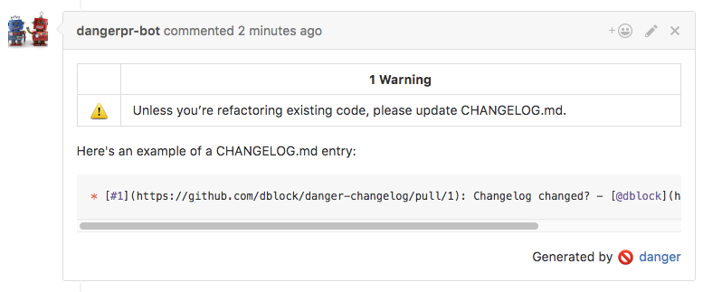
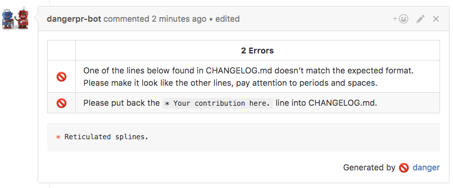

# danger-changelog

A pull request linter plugin to [danger.systems](http://danger.systems) that enforces CHANGELOG.md O.C.D. in your projects.
This plugin can, for example, make sure the changes are attributes properly and that they are always terminated with a period.

[](https://badge.fury.io/rb/danger-changelog)
[](https://travis-ci.org/dblock/danger-changelog)

## Installation

Add `danger-changelog` to your Gemfile.

```
gem 'danger-changelog', '~> 0.1'
```

Add `changelog.check` to your Dangerfile. Make a pull request and see this plugin in action.

## Usage

Methods and attributes from this plugin are available in your `Dangerfile` under the `changelog` namespace.

### changelog.filename

Set the CHANGELOG file name, defaults to `CHANGELOG.md`.

### changelog.check

Run all checks with defaults.

#### changelog.have_you_updated_changelog?

Checks whether you have updated CHANGELOG.md.



#### changelog.is_changelog_format_correct?

Checks whether the CHANGELOG format is correct.



## Contributing

See [CONTRIBUTING](CONTRIBUTING.md).

## Copyright

Copyright (c) Daniel Doubrovkine, 2016

MIT License, see [LICENSE](LICENSE.txt) for details.
